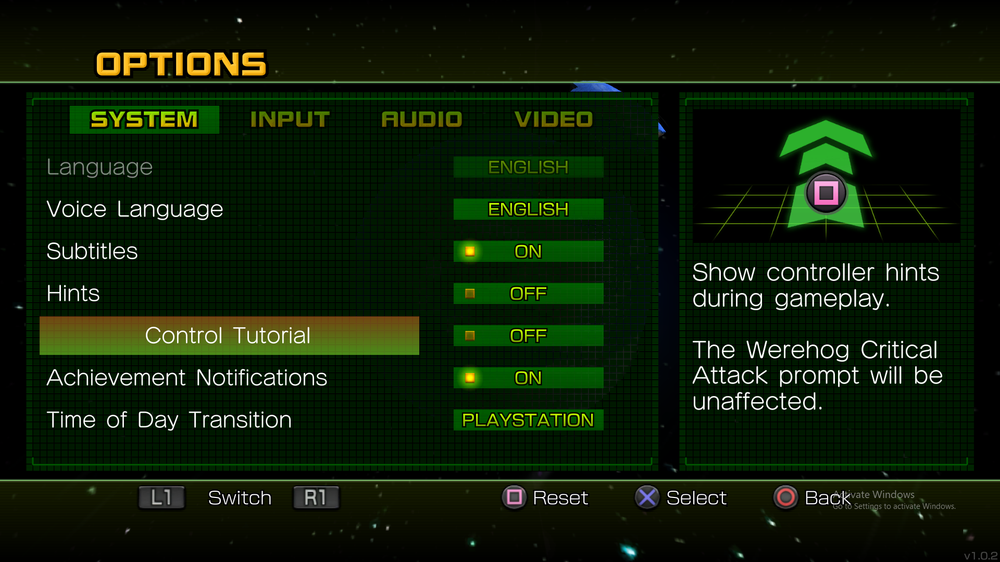

# Sonic Unleashed QTE Script
 A script that does QTEs in Sonic Unleashed (Doesn't include Tornado stages)

Fisrt the script creates a virtual controller (PS4 or Xbox 360, depends on what you choose) 
Then the script looks at the middle of the screen, looks for the appropriate buttons.  
Once it does, the script checks the screen again to make sure it's not missing a button.  
The script orders the buttons and then presses them with the virtual controller.

## Important
Only works if:  
- Unleashed is in the primary monitor
- You're in fullscreen (1920 x 1080) or 1650 x 1050. 
	(I tried to make the script work in different resolutions, but since I could only test in 1920 x 1080 since I only have 1080p monitors. 
	The script looks at your monitor display, not the Unleasded window).
	
## Notes
- Turn of control tutorials in the settings.  
	These can trigger the script in unintended places  
	For example, when it tells you to slide (Adabat Act 1)

## Prerequisites
1. Have Python downloaded

## Installation
1. Download the zip in releases
1. Extract the folder whereever you want
1. Right click the extracted folder and select "open in terminal"
1. Run tis command "pip install -r requirements.txt" 

## Usage
1. Run the Python script "unleashed_qte_script.py"
1. It will ask you to enter 1 or 0 for searching Playstation or Xbox buttons respectively
1. Pick a number for the buttons you use and press Enter (The script will say it's detecting).
1. Press Enter in the terminal to end the script.